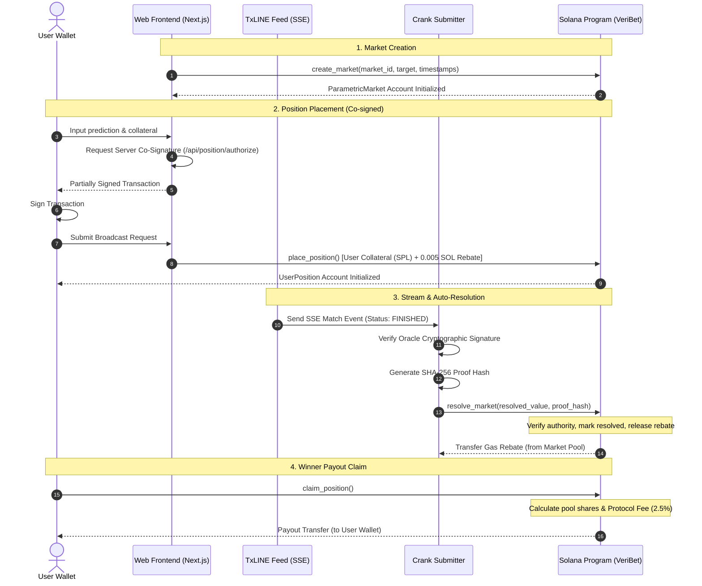

# VeriBet: Parametric Sports Prediction Market Protocol

An advanced, high-performance decentralized sports prediction market protocol on the Solana blockchain. VeriBet enables zero-slippage prediction pools that are settled instantly using cryptographic proofs and TxLINE stream feeds, powered by self-sustaining user-funded gas rebate cranks.

---
### Verification & On-Chain Proofs
- **Program ID:** `2Syq46YQQ4iGbCouFYxjeHEcABScMd669NAK5XrxZFWG`
- **Sample Settlement Tx:** [Verify via Solana Explorer](https://explorer.solana.com/tx/44vGJJhNo1VpMo4J3jS9FE6ehVGdvUagtVn8rS7vJsAoxTg4tvGSAZoDYGTbLomn75khShq5ep8uqDcq5kyZN1cS?cluster=devnet)
## 🚀 Key Features

* **Parametric Betting**: Bet on specific statistical targets (e.g., total goals > 2, score yes/no) rather than simple win/lose outcomes.
* **Stateless Off-chain Crank**: Autonomous off-chain workers monitor real-time game state streams via Server-Sent Events (SSE) and resolve markets on-chain within seconds of match conclusion.
* **Self-Sustaining Gas Rebate Pool**: Users pay a micro-contribution (0.005 SOL) when submitting a prediction to fund the crank's gas rebate, ensuring continuous, autonomous resolution without protocol subsidy.
* **Cryptographic Oracle Proofs**: Outcomes are secured using SHA-256 signatures, validated on-chain to eliminate administrative counterparty risks.
* **Server-Side Co-Signing (Delegation)**: Facilitates secure position creation by co-signing transactions via an authorized Next.js server route.
* **Premium Glassmorphism Frontend**: Responsive web interface with interactive market dashboards, leaderboard charts, and a cryptographic Proof Vault.

---

## 🏗️ Architecture Overview

The following diagram illustrates the interaction between the User, the Web App, the Crank Service, the TxLINE Data Feed, and the Solana Blockchain:



---

## 📁 Repository Structure

```
veribet/
├── Anchor.toml           # Anchor workspace configuration
├── Cargo.toml            # Rust workspace definition
├── package.json          # Workspace node scripts and root dev tools
├── tsconfig.json         # TypeScript config for tests
├── .env.example          # Template for required environment variables
├── README.md             # Project documentation (this file)
├── programs/
│   └── veribet/          # Solana Smart Contract (Rust Anchor)
│       ├── Cargo.toml
│       └── src/
│           ├── lib.rs          # Main program entrypoint
│           ├── constants.rs    # Program seeds and protocol configurations
│           ├── errors.rs       # Custom error codes
│           ├── state.rs        # Account structs and layouts (ParametricMarket, UserPosition)
│           ├── utils.rs        # Validations and fee calculations
│           └── instructions/
│               ├── create_market.rs   # Initialize predicting pool & vault
│               ├── place_position.rs  # Place prediction collateral & fund crank rebate
│               └── resolve_market.rs  # Resolve markets & claim winner payouts
├── apps/
│   └── web/              # Next.js Web App
│       ├── package.json
│       ├── next.config.js
│       └── src/
│           ├── app/
│           │   ├── page.tsx           # Glassmorphism Landing Page
│           │   ├── globals.css        # Global CSS stylesheet & design variables
│           │   ├── dashboard/         # Live market dashboard & leaderboard
│           │   ├── proof-vault/       # Cryptographic Proof Vault ledger explorer
│           │   └── api/
│           │       ├── stream/        # SSE Client Multiplexer (mock simulation fallback)
│           │       └── position/      # Server co-signing API endpoints
│           ├── components/            # UI components (MatchCard, PredictionForm, etc.)
│           ├── hooks/                 # Custom React hooks (useProgram, useTxLine)
│           └── lib/                   # Solana integration utilities (PDAs, transaction builder)
└── services/
    └── crank/            # Stateless Crank Service (TypeScript Node)
        ├── package.json
        ├── tsconfig.json
        └── src/
            ├── main.ts            # Entrypoint & SSE event listener
            ├── sse-client.ts      # Chunked Server-Sent Events parser
            ├── proof-handler.ts   # Cryptographic verification & SHA-256 hash generator
            ├── crank-submitter.ts # Solana transaction builder & submitter
            └── types.ts           # Shared type interfaces
```

---

## ⚙️ Smart Contract (Solana Program)

The VeriBet program is written using the Anchor framework.

### 1. Account Layouts

#### `ParametricMarket` (200 bytes total space)
Represents a prediction pool for a specific parametric event.
* **8-Byte Aligned Primitives (64 bytes)**:
  * `market_id`: `u64` (Unique identifier)
  * `sequence`: `u64` (Persistent database sequence check on restart)
  * `pool_side_a`: `u64` (Collateral pool for Home / Over / Yes)
  * `pool_side_b`: `u64` (Collateral pool for Away / Under / No)
  * `pool_side_draw`: `u64` (Collateral pool for Draw)
  * `total_fees_collected`: `u64` (Protocol fees collected for treasury)
  * `kickoff_timestamp`: `i64` (Hard deadline for placement)
  * `emergency_unlock_timestamp`: `i64` (Safety hatch timestamp)
* **Pubkeys & Hashes (96 bytes)**:
  * `vault_token_account`: `Pubkey` (Associated vault holding SPL token collateral)
  * `authority`: `Pubkey` (Creator/Admin authorized to resolve markets)
  * `proof_hash`: `[u8; 32]` (SHA-256 hash of the TxLINE proof event)
* **Fixed Arrays (16 bytes)**:
  * `match_id_bytes`: `[u8; 16]` (Ascii match identifier)
* **4-Byte Aligned Primitives (12 bytes)**:
  * `target_value`: `u32` (Parametric threshold target)
  * `resolved_value`: `u32` (On-chain verified result value)
  * `crank_gas_rebate_pool`: `u32` (Lamports accumulated to refund crank submission costs)
* **1-Byte Primitives (4 bytes)**:
  * `market_type`: `u8` (0 = Over/Under, 1 = Yes/No)
  * `market_status`: `u8` (0 = Open/Active, 1 = Resolved)
  * `is_resolved`: `bool` (Boolean state sentinel)
  * `bump`: `u8` (Canonical PDA bump)

#### `UserPosition` (120 bytes total space)
Tracks a single user's prediction and collateral.
* **Pubkeys (96 bytes)**:
  * `user_wallet`: `Pubkey` (User wallet address)
  * `delegated_authority`: `Pubkey` (Server-side co-signing key)
  * `market_address`: `Pubkey` (Associated market PDA)
* **8-Byte Aligned (8 bytes)**:
  * `collateral_amount`: `u64` (Token collateral amount)
* **1-Byte Primitives (4 bytes)**:
  * `prediction_vector`: `u8` (0 = Side A, 1 = Side B, 2 = Draw)
  * `claimed`: `bool` (Payout claim sentinel)
  * `position_bump`: `u8` (PDA bump)
  * `tier_level`: `u8` (Loyalty tier)
* **4-Byte Primitives (4 bytes)**:
  * `reference_nonce`: `u32` (Nonce matching off-chain ticket ID)

### 2. Instruction Set

| Instruction | Signers | Main Operations |
|---|---|---|
| `create_market` | `authority` (Signer), `market` (PDA) | Initializes `ParametricMarket` account state and creates the associated token vault account. |
| `place_position` | `user` (Signer) | Initializes a `UserPosition` account, transfers SPL tokens to the vault, transfers 0.005 SOL to the market PDA, and updates the pool's side totals. |
| `resolve_market` | `authority` (Signer) | Marks the market as resolved, updates the winning metric, transfers the 2.5% protocol fee to the authority, and refunds the crank submitter using the rebate lamports pool. |
| `claim_position` | `authority` (Signer - User or delegated authority) | Computes the payout based on pool shares, transfers winning tokens from the vault to the user, and marks the position as claimed. Refunds collateral if no winner exists. |

---

## ⚙️ Off-chain Crank Service

The crank service is a stateless TypeScript service that monitors match outcome event streams and automates on-chain settlement.

### Execution Loop:
1. Connects to the TxLINE SSE endpoint.
2. Receives chunked match events.
3. If an event status is `FINISHED`, verifies the event's cryptographic signature against the `ORACLE_PUBLIC_KEY` (using DER-encoded RSA/ECDSA verification). If `ORACLE_PUBLIC_KEY` is set to `mock`, it will bypass verification.
4. Performs a `getProgramAccounts` RPC call (`parametricMarket.all()`) to find all unresolved markets matching the match ID on-chain.
5. Encodes the event payload into a SHA-256 hash.
6. Submits the `resolve_market` transaction on-chain using the configured authority wallet.
7. Reclaims the gas costs from the market's rebate pool.

---

## 💻 Web App (Next.js)

The Next.js app provides an interface to interact with the prediction markets.

### 🛡️ Delegated Transaction Authorization
To enable gas-frictionless execution and enforce compliance rules:
1. The frontend constructs the `PlacePosition` instruction.
2. The user signs the transaction locally using their web wallet (e.g., Phantom, Solflare).
3. The partially-signed transaction is serialized and sent to `/api/position/authorize`.
4. The server validates the transaction rules and co-signs using the server's authority key.
5. The frontend deserializes the fully-signed transaction and broadcasts it to the Solana network.

### 📡 Server-Sent Events Multiplexer
The Next.js backend `/api/stream` endpoint acts as an SSE multiplexer:
* It attempts to stream live data from a real TxLINE SSE server.
* If the TxLINE server is unavailable, it automatically falls back to an **in-memory mock match simulation loop** that updates scores and randomly finishes matches every 5 seconds, allowing seamless local development and testing.

---

## 🛠️ Configuration & Setup

### Prerequisites
* Node.js (v18+)
* Rust & Cargo
* Solana CLI
* Anchor CLI (v0.30+)

### Environment Variables
Create a `.env` file in the project root following the `.env.example` template:
```env
RPC_URL=http://127.0.0.1:8899
PROGRAM_ID=2GGEMRrbf2E6CLBYGU47p42aCa7cByknAVwcrTUMoLUo
AUTHORITY_KEY_PATH=./authority-keypair.json
TXLINE_URL=http://localhost:4000/stream
ORACLE_PUBLIC_KEY=mock
```

### Installation

1. **Install Root dependencies**:
   ```bash
   npm install
   ```

2. **Build the Solana Program**:
   ```bash
   anchor build
   ```

3. **Run local validator**:
   ```bash
   solana-test-validator
   ```

4. **Deploy the Program**:
   ```bash
   anchor deploy
   ```

5. **Start Next.js Web App**:
   ```bash
   cd apps/web
   npm install
   npm run dev
   ```

6. **Start Crank Service**:
   ```bash
   cd services/crank
   npm install
   npm run dev
   ```

---

## ⚖️ Protocol Rules

* **Protocol Fees**: A `250 BPS` (2.5%) fee is deducted from the total betting pool during resolution and sent to the creator/authority.
* **Gas Rebate**: Every prediction places `5,000,000 lamports` (0.005 SOL) into the market rebate pool. This is fully distributed to the crank that resolves the market on-chain.
* **Safety Hatch**: If the oracle/crank goes offline and the `emergency_unlock_timestamp` has passed, users can claim a refund on their position regardless of match results.
