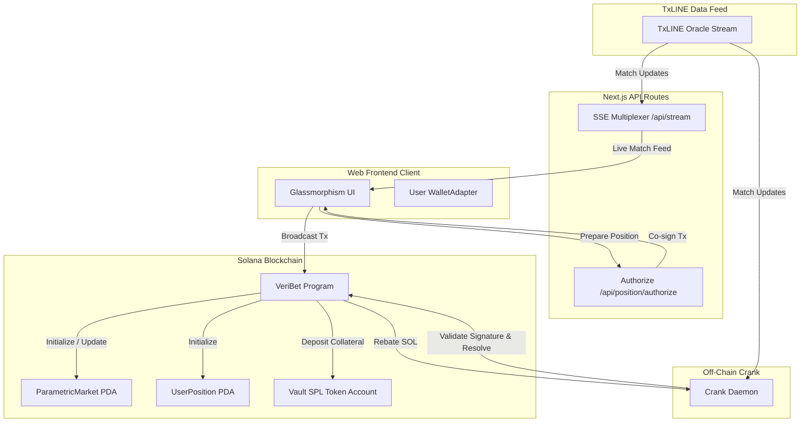
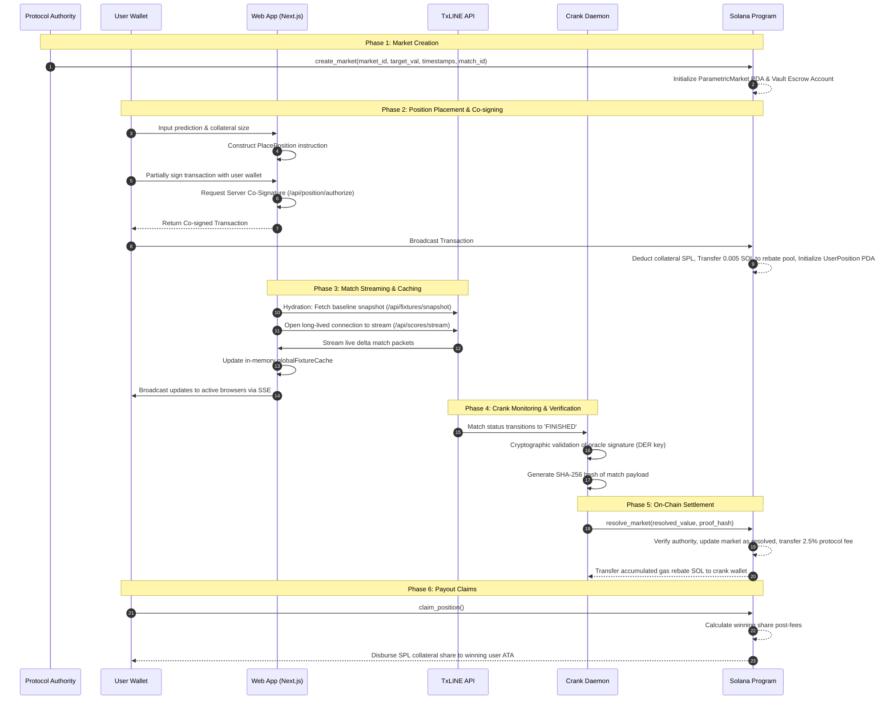

# VeriBet: System Report & Core Data Pipeline

VeriBet is a decentralized, parametric sports prediction market protocol deployed on the Solana blockchain (SVM) and integrated with a real-time Server-Sent Events (SSE) data feed. This report provides a detailed breakdown of the system components and traces the end-to-end data pipeline that drives the protocol's prediction, streaming, verification, and settlement mechanisms.

---

## 🏗️ 1. High-Level Architecture Overview

VeriBet's ecosystem consists of three primary, decoupled components:

1. **Solana Program (On-Chain Contract)**: Implemented using the Anchor framework, this manages the lifecycle of parametric prediction pools (`ParametricMarket`), escrow accounts, positions (`UserPosition`), protocol fees (2.5%), and a self-sustaining lamport rebate pool to fund automated off-chain resolutions.
2. **Stateless Crank Service (Off-Chain Settlement)**: A TypeScript Node.js daemon that listens to the match update stream, validates oracle signatures via cryptographic verification (DER-encoded RSA/ECDSA), maps outcomes to on-chain conditions, and triggers market resolutions on Solana.
3. **Web Application (Next.js & React)**:
   - **Frontend Dashboard**: A premium glassmorphism dashboard displaying active markets, user positions, and a cryptographic Proof Vault ledger explorer.
   - **SSE Multiplexer Route (`/api/stream`)**: Serves as a JIT (Just-In-Time) socket connection link between the client UI and the TxLINE oracle stream, featuring caching, token eviction, and exponential backoff reconnection.
   - **Co-Signing API (`/api/position/authorize`)**: Enforces compliance checks and executes server-side co-signatures to enable delegated transaction authority.

---

## 🧬 2. Core Data Pipeline (Step-by-Step Lifecycle)

The core data pipeline handles the end-to-end lifecycle of a prediction pool, from initialization to final payout claim. This pipeline can be broken down into six sequential phases:

### Phase 1: Market Creation
1. **Trigger**: The protocol administrator publishes a new match prediction pool on-chain.
2. **Execution**: Invokes `create_market` in the Solana program.
3. **Storage**:
   - Initializes a `ParametricMarket` PDA derived from the `market_id` seed.
   - Configures the target statistical threshold (`target_value`), match ID (`match_id_bytes`), and epoch timestamps (`kickoff_timestamp`, `emergency_unlock_timestamp`).
   - Creates a token escrow PDA `vault_token_account` owned by the market account to hold SPL token deposits.

### Phase 2: Position Placement & Co-signing
1. **User Action**: The user selects their prediction vector (Side A/Side B/Draw) and sets their collateral.
2. **Transaction Building**: The frontend builds the `PlacePosition` instruction. If the pool currency is Wrapped SOL (WSOL), the client prepends instructions to create the user's ATA, transfer SOL, and synchronize native tokens.
3. **Delegated Authorization Hook**:
   - The user signs the transaction locally using their browser wallet.
   - The frontend serializes the partially signed transaction and sends it to the Next.js API route `/api/position/authorize`.
   - The server validates transaction constraints and co-signs using the server's private `authority-keypair.json` (which matches the delegated authority address on-chain).
   - The server returns the co-signed transaction, which the client then broadcasts to the Solana RPC cluster.
4. **On-Chain Settlement Integration**:
   - The program transfers the user's SPL token collateral into the market vault.
   - The program executes a native SOL transfer of `5,000,000 lamports` (0.005 SOL) from the user's wallet into the market PDA, accumulating it into the `crank_gas_rebate_pool`.
   - Updates the pool sizes (`pool_side_a`, `pool_side_b`, `pool_side_draw`) and initializes a `UserPosition` PDA.

### Phase 3: Match Streaming & Caching
1. **Baseline Hydration**: On launch, the Next.js API route `/api/stream` fetches a baseline snapshot from the TxLINE oracle (`/api/fixtures/snapshot`), parsing and storing all current fixture states in an in-memory `globalFixtureCache`.
2. **Handshake Protocol**: The Next.js server requests a temporary Guest JWT from the TxLINE auth endpoint, then establishes a JIT connection to the SSE stream `/api/scores/stream`.
3. **Pipelined Multiplexing**:
   - As live score updates stream in, the server processes the data, modifies the local cache, and broadcasts updates via Server-Sent Events to all browser client listeners.
   - Network interruptions trigger an exponential backoff loop (ranging from 1s up to 30s). Unauthorized statuses (401/403) purge the stored configurations to force a fresh authorization handshake.

### Phase 4: Crank Monitoring & Verification
1. **Crank Daemon**: The off-chain crank worker listens to the TxLINE event stream (or the Next.js SSE proxy).
2. **Condition Trigger**: When a match status changes to `FINISHED`, the crank intercepts the event.
3. **Cryptographic Validation**:
   - The crank validates the event payload signature using a DER-encoded public key.
   - It computes a SHA-256 proof hash of the serialized JSON payload.
4. **On-Chain Discovery**: The crank calls `parametricMarket.all()` via Solana RPC to retrieve all unresolved market PDAs on-chain that match the match identifier.

### Phase 5: On-Chain Settlement
1. **Resolution Call**: For each matched market, the crank signs and submits a `resolve_market` transaction on-chain.
2. **On-Chain Logic**:
   - Evaluates the outcome: If the market is Over/Under (`market_type == 0`), the resolved value is the raw statistic (`event.totalStats`). If Yes/No (`market_type == 1`), the resolved value is 1 (if the threshold is met) or 0.
   - The program sets `is_resolved = true`, stores the SHA-256 proof hash as an on-chain receipt, and updates the status to 1.
3. **Protocol Fees**: Deducts a 2.5% protocol fee from the total collateral pool and transfers it to the market creator's token account.
4. **Gas Rebate Disbursement**: The program calculates the accumulated `crank_gas_rebate_pool` lamports and transfers them directly to the `crank` transaction fee-payer, offsetting their transaction costs.

### Phase 6: Payout Claims
1. **Claim Execution**: Winners call `claim_position` from the web app UI (or through the server-side delegated authority).
2. **Reward Calculation**:
   - The contract calculates the winning vector (Side A / Side B / Draw) based on the on-chain resolved value and target value.
   - If there is a winner, the payout is distributed proportionally:
     $$\text{Payout} = \frac{\text{User Collateral} \times \text{Total Pool (after fees)}}{\text{Winning Pool}}$$
   - If there are no bets on the winning side, the program refunds the original collateral amount to all participants.
3. **Disbursement**: Escrow tokens are transferred from the market vault to the user's token account, and the `claimed` flag on the `UserPosition` account is set to `true`.

---

## 🛠️ 3. Directory & File Reference Guide

The codebase is organized as follows:

| Directory/File | Description | Primary Role in the Pipeline |
| :--- | :--- | :--- |
| [programs/veribet/src/lib.rs](file:///home/seam/Desktop/project/veribet/programs/veribet/src/lib.rs) | Solana Program Entrypoint | Entrypoint routing for all instructions. |
| [programs/veribet/src/state.rs](file:///home/seam/Desktop/project/veribet/programs/veribet/src/state.rs) | Struct Account Layouts | Defines structure and sizing for `ParametricMarket` and `UserPosition`. |
| [instructions/create_market.rs](file:///home/seam/Desktop/project/veribet/programs/veribet/src/instructions/create_market.rs) | Market Initializer | Creates prediction markets and sets up escrow token vaults. |
| [instructions/place_position.rs](file:///home/seam/Desktop/project/veribet/programs/veribet/src/instructions/place_position.rs) | Position Placer | Places collateral, records the prediction, and funds the gas rebate pool. |
| [instructions/resolve_market.rs](file:///home/seam/Desktop/project/veribet/programs/veribet/src/instructions/resolve_market.rs) | Settler & Claim Handler | Processes on-chain resolution, fees, crank rebates, and winner payouts. |
| [services/crank/src/main.ts](file:///home/seam/Desktop/project/veribet/services/crank/src/main.ts) | Crank Service Entrypoint | Connects to the SSE stream, scans markets, and triggers resolution loops. |
| [services/crank/src/proof-handler.ts](file:///home/seam/Desktop/project/veribet/services/crank/src/proof-handler.ts) | Cryptographic Verification | Verifies oracle signatures and generates SHA-256 hashes of matches. |
| [apps/web/src/app/api/stream/route.ts](file:///home/seam/Desktop/project/veribet/apps/web/src/app/api/stream/route.ts) | SSE Multiplexer Route | Connects to TxLINE SSE, manages a local cache, and streams to browsers. |
| [apps/web/src/app/api/position/authorize/route.ts](file:///home/seam/Desktop/project/veribet/apps/web/src/app/api/position/authorize/route.ts) | Server-Side Co-signer | Authorizes user transactions and applies server-side co-signatures. |
| [apps/web/src/lib/solana.ts](file:///home/seam/Desktop/project/veribet/apps/web/src/lib/solana.ts) | Transaction Construction | Derives PDAs, builds place instructions, and intercepts co-signer keys. |

---

## 🔒 4. Key Protocol Invariants & Design Decisions

### Gas-Free Delegated Authority Co-Signing
Rather than requiring users to manually manage keypair permissions or execute multiple transactions, VeriBet implements a **co-signing gateway**.
- The client transaction contains the user signature *and* requires a signature from the `delegatedAuthority` specified in the `UserPosition` account.
- The web app intercepts instructions, modifies the transaction's account keys to mark the delegated authority as a signer, and forwards the transaction to the server for a co-signature. This ensures compliance rules are met prior to contract invocation.

### Self-Sustaining Gas Rebates
To avoid depleting protocol reserves with automated off-chain updates:
- Every prediction transaction deposits `5,000,000 lamports` (0.005 SOL) into the market PDA's account balance.
- Upon calling `resolve_market`, these accumulated lamports are automatically transferred to the crank's wallet. This mechanism offsets the crank's transaction fees, enabling a decentralized, self-sustaining off-chain resolution network.

### Liveness Escape Hatches
To prevent locking user collateral if the oracle stream goes offline or the crank fails to resolve a market:
- The contract records an `emergency_unlock_timestamp` during market creation.
- If this timestamp has passed and the market is still unresolved, users can claim a full refund of their collateral, protecting their capital.
