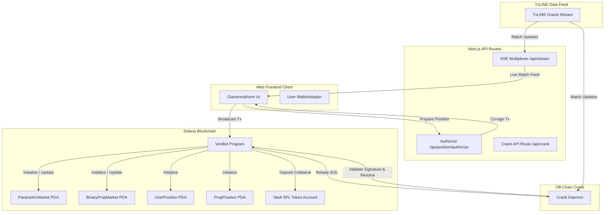
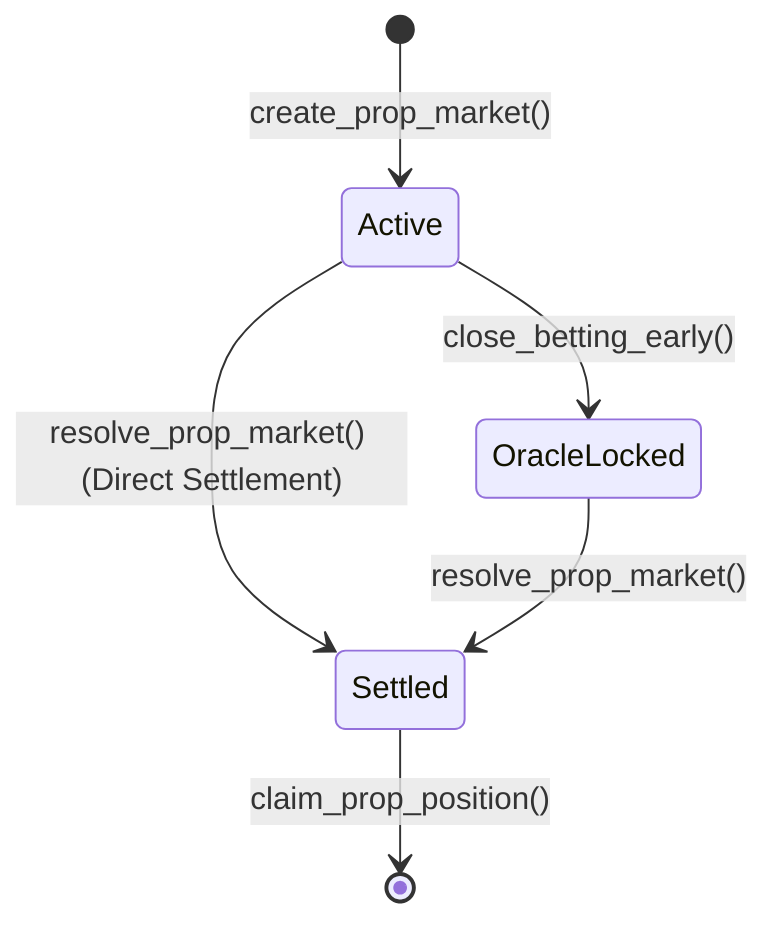

# VeriBet: Complete Protocol & System Documentation

VeriBet is an advanced, high-performance decentralized sports prediction market protocol on the Solana blockchain (SVM). It enables zero-slippage prediction pools that are settled instantly using cryptographic proofs and TxLINE stream feeds, powered by self-sustaining user-funded gas rebate cranks.

---

## 🏗️ 1. System Architecture & Component Mapping

VeriBet's ecosystem consists of three primary, decoupled components:



### System Components:
1. **Solana Program**: Implemented via Anchor, managing the prediction state, parimutuel pools, and claim escrow vaults.
2. **Off-Chain Crank Daemon**: A TypeScript service listening to the TxLINE event stream to resolve markets automatically upon match finalization.
3. **Web Interface (Next.js)**: Integrates Solana wallet adapters, showcases live statistics from the SSE proxy stream, and hosts a cryptographic Proof Vault.

---

## 🧬 2. On-Chain Memory Layouts & State Boundaries

To support deterministic memory filters (`memcmp`) and prevent corruption, VeriBet aligns its structs with fixed-size types placed before dynamic components.

### 2.1 ParametricMarket Account Layout
Represents standard over/under or numerical parametric prediction pools.
* **Size**: 200 bytes
* **Fields**:
  - `market_id`: `u64` (Unique identifier)
  - `sequence`: `u64` (Persistent sequence number tracking)
  - `pool_side_a` / `pool_side_b` / `pool_side_draw`: `u64` (Parimutuel pools)
  - `total_fees_collected`: `u64` (Accumulated protocol fee)
  - `kickoff_timestamp`: `i64` (Betting deadline)
  - `emergency_unlock_timestamp`: `i64` (Safety liveness escape hatch)
  - `vault_token_account`: `Pubkey` (Associated SPL token vault PDA)
  - `authority`: `Pubkey` (Creator/Authority key)
  - `proof_hash`: `[u8; 32]` (SHA-256 hash of TxLINE proof)
  - `match_id_bytes`: `[u8; 16]` (Ascii match identifier)
  - `target_value`: `u32` (Threshold target)
  - `resolved_value`: `u32` (Verified game result score)
  - `crank_gas_rebate_pool`: `u32` (Accumulated lamports for crank payouts)
  - `market_type`: `u8` (0 = Over/Under, 1 = Yes/No)
  - `market_status`: `u8` (0 = Active, 1 = Resolved)
  - `is_resolved`: `bool`
  - `bump`: `u8`

### 2.2 BinaryPropMarket Account Layout
Represents customized yes/no prop prediction markets with strict state boundaries.
* **Lifecycle Enum**:
  ```rust
  pub enum LifecycleState {
      Active,       // 0x00: Open for placement
      OracleLocked, // 0x01: Closed early, awaiting resolution
      Settled,      // 0x02: Resolved, payouts claimable
  }
  ```
* **Reordered Fixed-Size Layout**:
  - `market_id`: `[u8; 32]` (Offset 8)
  - `match_id`: `[u8; 32]` (Offset 40)
  - `total_yes_pool`: `u64` (Offset 72)
  - `total_no_pool`: `u64` (Offset 80)
  - `lifecycle`: `LifecycleState` (Offset 88: Fixed 1-byte byte offset)
  - `cryptographic_proof`: `[u8; 32]` (Offset 89)
  - `creator`: `Pubkey` (Offset 121)
  - `oracle_authority`: `Pubkey` (Offset 153)
  - `vault_token_account`: `Pubkey` (Offset 185)
  - `display_title`: `String` (Dynamic, placed at the end)

### 2.3 UserPosition & PropPosition layouts
* `UserPosition` tracks parametric market positions (120 bytes).
* `PropPosition` tracks binary prop market positions, containing:
  - `bettor`: `Pubkey`
  - `market`: `Pubkey`
  - `amount`: `u64`
  - `side`: `bool` (true = YES, false = NO)
  - `claimed`: `bool`
  - `bump`: `u8`

---

## 🔄 3. Transaction Execution & State Transitions

VeriBet enforces strict boundaries for its prediction lifecycle state transitions:



### State Boundary Guards:
- **`place_prop_bet`**: Enforces `market.lifecycle == LifecycleState::Active`. Any bet attempts while `OracleLocked` or `Settled` will fail immediately with `VeriBetError::MarketClosed`.
- **`close_betting_early`**: Modifies the state from `Active` to `OracleLocked`.
- **`resolve_prop_market`**: Shifts the state to `Settled`.
- **`claim_prop_position`**: Enforces `market.lifecycle == LifecycleState::Settled`. Claims made prior to settlement will fail with `VeriBetError::MarketNotResolved`.

---

## 🚀 4. Settlement Crank & Sequence Sanitization

Off-chain submitters connect to TxLINE SSE events to capture, verify, and resolve matches in near real-time.

### 4.1 Oracle Sanitization & Secp256k1 Signatures
1. **Signature Ingestion**: The crank captures the Base64/Hex DER-encoded secp256k1 signature emitted by the TxLINE stream.
2. **On-Chain Signature Verification**: On-chain instructions can verify secp256k1 signatures to guarantee data source integrity.

### 4.2 Replay Protection via Sequence Numbers
To prevent replay attacks and out-of-order event resolutions, both the crank worker and the Next.js cron API enforce sequence number validation:
1. The parser extracts the transaction sequence number (`Sequence`) from the TxLINE event payload.
2. The logic fetches the target market from the Solana ledger and compares:
   $$\text{eventSequence} \geq \text{onChainSequence}$$
3. If the event sequence is lower, the transaction is rejected as a stale replay attempt, halting execution.

---

## 📡 5. Client-Side Partitioning & RPC Filtering

To optimize bandwidth and memory consumption, the Next.js frontend uses RPC `memcmp` memory filters to fetch pre-partitioned market records.

### 5.1 Active Markets (Dashboard)
The dashboard (`apps/web/src/app/dashboard/page.tsx`) queries only active, bettable prop markets:
- **Offset**: `88` (matching the `lifecycle` enum field)
- **Value**: `"1"` (Base58 representation of `0x00` representing `LifecycleState::Active`)
- **Query Configuration**:
  ```typescript
  program.account.binaryPropMarket.all([
    {
      memcmp: {
        offset: 88,
        bytes: "1", // LifecycleState::Active
      }
    }
  ]);
  ```

### 5.2 Cryptographic Proof Vault (Audit Feed)
The Proof Vault (`apps/web/src/app/proof-vault/page.tsx`) displays only settled markets:
- **Offset**: `88` (matching the `lifecycle` enum field)
- **Value**: `"3"` (Base58 representation of `0x02` representing `LifecycleState::Settled`)
- **Query Configuration**:
  ```typescript
  program.account.binaryPropMarket.all([
    {
      memcmp: {
        offset: 88,
        bytes: "3", // LifecycleState::Settled
      }
    }
  ]);
  ```

---

## 💻 6. Setup, Compilation, & Run Guide

### 6.1 Prerequisites
- Node.js (v18+)
- Rust & Cargo (Solana stable toolchain)
- Anchor CLI (v0.30+)
- Local Solana validator (`solana-test-validator`)

### 6.2 Running local compilation
1. **Install Dependencies**:
   ```bash
   npm install
   ```
2. **Build and Test the Anchor Program**:
   ```bash
   anchor build
   anchor test
   ```
3. **Run Web Client**:
   ```bash
   cd apps/web
   npm run dev
   ```
4. **Run Crank Daemon**:
   ```bash
   cd services/crank
   npm run dev
   ```
